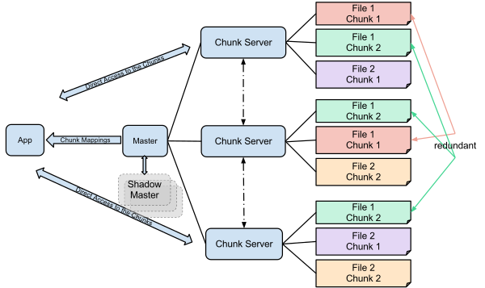

+++
title = "Google File System"
date = 2025-08-25
+++

> This is a re-hash of a post from my old Medium blog. Back then, I was reading system design papers but had not really worked on large-scale systems much yet, so it was harder to see the scope of impact of a system in the industry at-large, especially one as foundational as GFS, so I took a chance to revise and compare to my current work on Amazon Aurora.

The Google file system (GFS) is a distributed file system, which was created as a solution to serve the highly concurrent streaming data applications managed by Google.

## Goals and Constraints

GFS was designed to be tightly coupled with the workloads of its internal clients, and leveraged massive scales of commodity hardware, to optimize for fault-tolerance in the face of hardware failure.

As an internally-motivated system, GFS's design is highly opinionated in terms of the workload patterns expected by clients, with a goal of enabling **performant, highly concurrent append heavy workloads**.

1. read workload consists mainly of large streaming reads (several hundred kb to multiple mb, over contiguous region of a file), with some small random reads
2. write workload consists mainly of large sequential appends to files (similar size to large reads), with few small random writes (files tend to be unmodified after being written)
3. Prioritize steadily sustained high throughput for batch data processing jobs, overally optimizing individual operation latency.

## Key Contributions of GFS

There are many remarkable contributions resulting from GFS, and I think some of the keys ones are:

1. Simplifying metadata operations and replica placement/management with a single master architecture
2. Decoupling data and metadata operations: Maintaining all metadata in a single master independent of the underlying data, and using chunk leases to avoid metadata operations in the read/write path.
3. Checkpointing and logging, to achieve consistency and optimize master (single point of failure) recovery.
4. Lazy disk allocation and garbage collection through messaging and metadata purging
separating data flow from commit of mutations to chunks

## Comparing GFS to Amazon Aurora

> This was an a-ha for me, thinking again about a paper I read years back but without being able to quantify or see the downstream influence of, but now with a slightly more mature perspective it's pretty remarkable.

Amazon Aurora is a cloud database service, serving PostgreSQL and MySQL with independently scaling compute and storage, through a purpose-built distributed file system. Aurora's storage system has a lot of overlapping tenets with GFS, including:

1. Separation of the filesystem metadata from the underlying data, and serving the filesystem metadata entirely in memory.
2. Independently replicating fixed-size partitions of the storage system.
3. Checkpointing and journaling of the filesystem, to maintain consistency and optimize recovery.
4. Lazy reclamation of storage space.

Additionally, there is a similar pushdown of consistency guarantees to the client (the RDBMS in Aurora's case). In practice, this involved re-designing the transaction protocol for logging to a distributed storage system, compared to the classical WAL log.

We see how Aurora's similar reliance to GFS, in the employment of an in-memory filesystem resulted in a bottleneck for P99-scale customers, which [Atlassian has discussed](https://www.atlassian.com/blog/atlassian-engineering/migrating-jira-database-platform-to-aws-aurora) as a consideration when migrating their production database fleet entirely to Aurora PostgreSQL.

> Aurora was a groundbreaking system in its separation of the database's compute and storage resources, but  clearly had inspiration, like many other systems, from GFS.

## Detailed Architecture

> This is a summarized description of the architecture in comaprison to the original post.

GFS clusters consist of a single master node, which serves as the global filesystem manager, along with a set of chunkservers, which stored and serve the underlying data. The master logically manages the distributed filesystem by maintaining:

1. file and chunk namespace.
2. file-to-chunk mapping.
3. chunk replica locations.

GFS's filesystem design is optimized to best suit systems with large files, as opposed to large numbers of files, with the filesystem maintaining 64 bytes of metadata per file, and attempting to store all filesystem metadata in memory.

GFS partitions and replicates data across a set of "chunkservers", which coordinate with the master to correlate the logical filesystem to underlying physical data locations.

### Decoupling data and control flow

Separating the file system metadata (stored solely by the master) and file data (stored across chunk servers) ensures that the single master does not result in a bottleneck.

> "The client translates the file name and byte offset … into a chunk index …it sends the master a request containing the file name and chunk index. The master replies with the corresponding chunk handle and locations of the replicas. The client caches this information…"

From this point onward, any data operations require no interaction between the client and the master node and can be directly sent to the chunk replica, while the master continues to serve metadata operations.

### Operation Log

The operation log serves a similar purpose to a database transaction log, and is used to ensure a consistent logical timeline of file system metadata mutations. On any metadata mutations, the master first logs these operations in a serial order to the operation log, and replicates the log, before committing the mutations and responding to the client.

Maintaining an operation log ensures we can restore the state of the master by simply replaying the series of mutations written to the log, as well as ensuring that failed operations do not leave the file system metadata in a corrupted state.

To optimize further, GFS periodically checkpoints and truncates the operation log, reducing the tail log to apply when recovering the master's filesystem view, as well as backing up checkpoints and tail log periodically for disaster recovery.

### Chunk Leases

Since the master is not involved in data operations, it must transfer the power to one of the chunk replicas to determine a serialized mutation order. This is handled by assigning a "lease" to one of the replicas for a particular chunk.

Chunk leases are revoked after a short timeout, or can be revoked manually by the master if the chunk needs to be shielded from any mutations. For the most part though, chunks which are consistently being mutated will not have their leases revoked as chunkservers can request to extend these leases through communication with the master.

On a cold read of a chunk, clients will query and cache chunk information from the master, including the primary replica for writes, and the set of replicas for reads.

For a chunk write, the set of mutations on the chunk are broadcast to all chunk replicas by the client, with the primary replica deciding the order for all replicas to apply the mutations, applying the mutations in this order, and subsequently broadcasting the order to all replicas to replay as well. Writes are only considered successful when all secondaries acknowledge they completed the write to the primary, and it is possible that a chunk write can be torn across replicas.

Since the primary replica decides a logical mutation order that all secondaries must follow, clients can broadcast writes to chunk replicas in any order, rather than ordering based on the primary server.

### Consistency Model

GFS consistency is based on a defintion of all mutations, based on the following possible states:

1. Consistent: clients see the same data regardless of the replica read from, concurrent mutations can leave the data consistent, but the data may be made up of fragments of multiple mutations
2. Defined: the region is consistent and the mutation succeeds without interference from concurrent writers (all clients see what the mutation has written)
3. Undefined: different clients may see different data (result of a failed mutation)

GFS clients only need be able to distinguish between defined and undefined regions. This is due to the nature of serial mutation order being selected by the chunk replica currently holding the lease, meaning the mutations will be applied in the same way to all replicas. 

Since GFS uses chunk versioning, stale chunks will not be mutated, and won't be broadcasted to clients reading the chunk, ensuring all replicas that can be read will be consistent with one another.

Although stale chunk replicas may have their locations cached by the client (and therefore could be read from), the append-heavy workload of GFS clients tends to minimize the adverse effects of reading stale data.

GFS emphasizes client reliance on append-only writes and writing self-validating records to achieve application consistency in the face of GFS's own relaxed consistency.

### Replica Placement

Chunk replica placement occurs for multiple reasons, which are as follows:

1. Replicating chunks on creation to provide data integrity
2. Rewriting chunks when existing replicas have become stale or chunkservers become unresponsive
3. Load balancing disk utilization across chunkservers.

### Garbage Collection

Like GFS file allocation, which is executed lazily, garbage collection is a lazily handled background task, which is a combination of periodic communication between chunkservers and the master, and scanning and modification of the file system metadata by the master.

When files are deleted, they are simply "hidden" by name only in the file system namespace, and the chunks are not immediately reclaimed, rather, the master will later asynchronously garbage collect all dead chunks update the filesystem metadata, and broadcast relevant chunkservers about chunks that have been reclaimed.

This process of garbage collection also allows amortization of storage reclamation, by batching chunks to reclaim for each chunkserver, rather than eagerly one at a time.